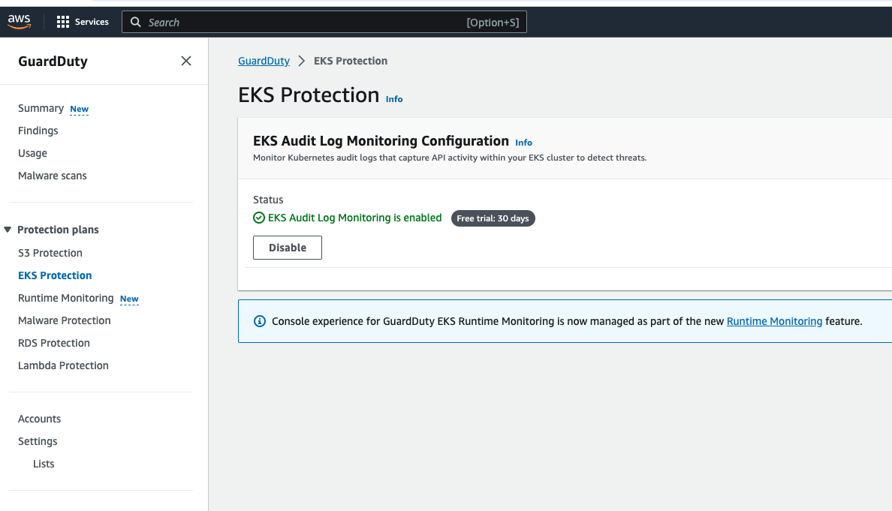

# WIP

### Why AWS GuardDuty?

- To protect your aws accounts with intelligent threat detection (1*)

- It has capable of analysing tens of billions of events per minute across multiple AWS data sources (2*) such as:

  - AWS CloudTrail event logs, 
  - Amazon Virtual Private Cloud (Amazon VPC) Flow Logs, 
  - DNS query logs, 
  - Amazon Simple Storage Service (Amazon S3) data plane events, 
  - Amazon Elastic Kubernetes Service (Amazon EKS) audit logs, and 
  - Amazon Relational Database Service (Amazon RDS) login events 
  
### AWS EKS Protection with GuardDuty (4*) 

- GuardDuty launched Amazon EKS protection to monitor control plane activity by analyzing Kubernetes audit logs from existing and new EKS clusters in your accounts. 

- Configure EKS Runtime Monitoring in GuardDuty (enable EKS Runtime Monitoring)
  - 
  - Once you enable EKS Runtime Monitoring, GuardDuty can start monitoring and analyzing the runtime-activity events for all the existing and new EKS clusters for your accounts.

### Resources

1* https://aws.amazon.com/guardduty/

2* https://marcincuber.medium.com/amazon-guardduty-deploy-eks-runtime-monitoring-using-terraform-45bbce1a3d1c

3* https://docs.aws.amazon.com/guardduty/latest/ug/what-is-guardduty.html

4* https://aws.amazon.com/blogs/aws/amazon-guardduty-now-supports-amazon-eks-runtime-monitoring/